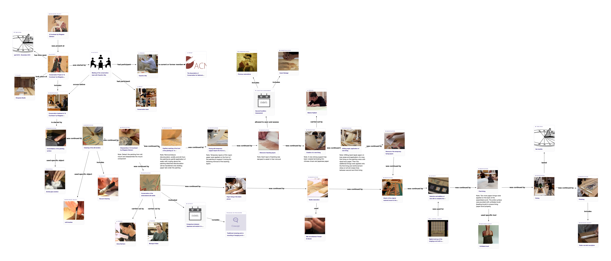

<p align='center'>
  
</p>

<p align='center'>ResearchSpace is licensed under the GNU Affero General Public License, version 3 or later (AGPL v3 or later). see LICENSE file </p>

- - -

<p align="center">
  <a href="https://nightly.link/researchspace/researchspace/workflows/main/master/zip-bundle.zip">
    </a> 
  <a href="https://hub.docker.com/repository/docker/researchspace/platform-ci/general">
    </a>
  <a href="https://gitter.im/researchspace/community">
    </a>
</p>

- - -

[ResearchSpace](https://www.researchspace.org/) is a new type of contextualising knowledge system. It promotes collaborative interdisciplinary research allowing people to grow knowledge that relates to and reveals different aspects of society.

It challenges the instrumental nature of technology and allows subject experts to become authors of meaningful forms of structured data, combined with visual and textual narrative.

The ResearchSpace system has been designed to allow researchers to connect qualitative and quantitative research, to transition from information systems that solely capture and index ‘essential’ reference material, to ones that address the complexity and richness of the research itself and provide a natural ‘relational’ method that traverses space and time, supporting different levels of complexity, variety of vantage point, and the represention of arguments and meta-commentary in a collaborative environment.

<a href="http://www.youtube.com/watch?feature=player_embedded&v=MaAv0SE7wis
" target="_blank"></a>

# Knowledge Base 
**To Be Added**

# Demo 
Changing the methods of research in the humanities requires innovation in how we combine the qualitative with the quantitative through collaborative research, expressive structured data, and a human-centered and participatory approach to the ‘knowledge graph’.

> A  “a knowledge graph is a continually changing informational structure that mediates between a human, the world and a computer. The graph itself is ontologically based and enhanced by human epistemology. These are closely linked in that the ontology provides real world references and a structure of interrelated entities or processes, while the epistemology uses the graph to interpret and generate new knowledge. Growing the graph is based on both automated reasoning and crucially, collaborative human thinking and creativity.”

[Oldman and Tanase](https://link.springer.com/chapter/10.1007/978-3-030-00668-6_20)

This demo is an invitation to explore new ways of researching using as example our research on the hanging scroll "A Courtesan Reading a Letter" by Kitagawa Utamaro.


[Download Preview Demo with Example Data](https://github.com/researchspace/researchspace/releases/download/v3.4.0-preview/researchspace-3.4-preview-demo-bundle.zip) - ResearchSpace bundled with demo data, [blazegraph triplestore](https://blazegraph.com/) and [digilib](https://robcast.github.io/digilib/) IIIF viewer.

[Download Preview Release](https://github.com/researchspace/researchspace/releases/download/v3.4.0-preview/researchspace-3.4-preview-bundle.zip) - empty ResearchSpace bundle with [blazegraph triplestore](https://blazegraph.com/) and [digilib](https://robcast.github.io/digilib/) IIIF viewer.


*Figure: Conservation Process for A Courtesan Reading a Letter by Kitagawa Utamaro*


# Technical Documentation

The following documentation covers the setting up of the ResearchSpace Platform in [production](#setup-with-docker) and [development](#developing-and-bulding-from-sources) mode. 
The ResearchSpace platform's **browser compatibility** is **Google Chrome (minimum version 53)** and **Mozilla Firefox (minimum version 58)**.
Use of this platform in other browsers or older versions of Chrome or Firefox is not currently supported.

# License
The ResearchSpace is distributed under AGPL-3.0 or later.

# How to try it?

> :warning: **WARNING**: Currently we are working on demo application .....

The easiest way to try researchspace is to use a [setup with docker-compose](#setup-with-docker). 

# Overview

<!--ts-->
   * [Knowledge Base](#knowledge-base)
   * [Demo](#demo)
   * [Technical Documentation](#technical-documentation)
   * [License](#license)
   * [How to try it?](#how-to-try-it)
   * [Overview](#overview)
   * [Setup with docker](#setup-with-docker)
   * [Setup with ZIP bundle](#setup-with-zip-bundle)
   * [Developing and building from sources](#developing-and-building-from-sources)
      * [Prerequisites](#prerequisites)
         * [Prerequisites Installation on <em>Ubuntu</em>](#prerequisites-installation-on-ubuntu)
         * [Prerequisites Installation on <em>MacOS</em>](#prerequisites-installation-on-macos)
         * [Prerequisites Installation on <em>Windows 10</em>](#prerequisites-installation-on-windows-10)
      * [Running the ResearchSpace in Development Mode](#running-the-researchspace-in-development-mode)
         * [Run ResearchSpace with bundeled blazegraph triplestore and digilib IIIF server](#run-researchspace-with-bundeled-blazegraph-triplestore-and-digilib-iiif-server)
         * [Run ResearchSpace with your own triplestore and IIIF server](#run-researchspace-with-your-own-triplestore-and-iiif-server)
      * [Testing](#testing)
      * [Debugging](#debugging)
            * [Backend](#backend)
            * [Frontend](#frontend)
         * [Backend Logging](#backend-logging)
      * [Building WAR artefact](#building-war-artefact)
      * [Build zip bundle](#build-zip-bundle)
      * [Building Docker image](#building-docker-image)
      * [Setup IDE](#setup-ide)
            * [Eclipse](#eclipse)
            * [VSCode](#vscode)
      * [Codestyle &amp; Linting](#codestyle--linting)
         * [Java](#java)
         * [Typescript &amp; SCSS](#typescript--scss)
      * [Generate JSON Schema from JSDoc](#generate-json-schema-from-jsdoc)
      * [Troubleshooting](#troubleshooting)
         * [Security certificate issues when building the platform](#security-certificate-issues-when-building-the-platform)

<!-- Added by: artem, at: Tue 23 Jun 2020 02:42:37 PM EEST -->

<!--te-->

# Setup with docker
Latest docker images for ResearchSpace are available on [Docker Hub](https://hub.docker.com/r/researchspace/platform-ci). 

*docker-compose* scripts for ResearchSpace setup are available in [researchspace-docker-compose repostiory](https://github.com/researchspace/researchspace-docker-compose). 

On the first run you need to import default ontologies and knowledge patterns for CIDOC-CRM, see [instance configuration repository](https://github.com/researchspace/researchspace-instance-configurations)

# Setup with ZIP bundle
Download the latest ZIP bundle from the latest [CI build](https://github.com/researchspace/researchspace/actions?query=branch%3Amaster) artefacts and follow instructions in the README file inside the ZIP.

On the first run you need to import default ontologies and knowledge patterns for CIDOC-CRM, see [instance configuration repository](https://github.com/researchspace/researchspace-instance-configurations)

# Developing and building from sources

## Prerequisites
It is possible to use an unix-based OS as well as Windows for development against the platform. As prerequisites you need to have installed on your machine:

* JDK 11 (you can use Java 14 to run the ResearchSpace but version 11 is currently the only supported version for development).
* Latest Node.js LTS (12.x) is recommended, but any newer Node.js version should be also fine.

In particular, on OSX and Unix systems the most stable versions for Node.js are usually available from common package managers (e.g. homebrew, apt) and as such easy to install and to upgrade.

On Windows the use of [Chocolatey](https://chocolatey.org/) is highly recommended.

### Prerequisites Installation on *Ubuntu*

**Java 11 JDK**

`sudo apt install openjdk-11-jdk`

**Node.js**

`curl -sL https://deb.nodesource.com/setup_12.x | sudo -E bash -`
`sudo apt install nodejs npm`

### Prerequisites Installation on *MacOS*

**Homebrew Installation**

`/usr/bin/ruby -e "$(curl -fsSL https://raw.githubusercontent.com/Homebrew/install/master/install)"`

**Java 11**

`brew tap AdoptOpenJDK/openjdk`
`brew cask install adoptopenjdk11`

**Node.js**

`brew install node@12`

### Prerequisites Installation on *Windows 10*
See [installation instruction](https://chocolatey.org/docs/installation) for [Chocolatey](https://chocolatey.org).

**Java 11**

`choco install adoptopenjdk11 -y`

**Node**

`choco install nodejs-lts -y`

## Running the ResearchSpace in Development Mode

In development mode we recommend to run ResearchSpace with bundled blazegraph and digilib, but you can also run it with your own triplestore and iiif server.

When build is completed go to [http://127.0.0.1:10214/](http://127.0.0.1:10214/), where you should see the login screen. Default platform access username and password are  `admin:admin`

### Run ResearchSpace with bundeled blazegraph triplestore and digilib IIIF server

Enter the following into your terminal (for Linux and Mac):

```sh
./gradlew runAll
```

For Windows:
```sh
.\gradlew.bat runAll
```

Gradle will resolve some dependencies and then compile all sources and start the jetty server. Gradle watchs source directories for changes in order to trigger incremental compilation, so any change to the server-side or client-side sources triggers re-deployment, which takes no more than a few seconds until they are picked-up by Jetty.

Note, it may take a few minutes to complete starting the platform on the first run; it should be quicker on subsequent runs.

You should see console output similar to:

```
21:24:49 INFO  Jetty 9.4.24.v20191120 started and listening on port 10214
21:24:49 INFO   runs at:
21:24:49 INFO    http://localhost:10214/
21:24:49 INFO  Bigdata runs at:
21:24:49 INFO    http://localhost:10214/blazegraph
21:24:49 INFO  digilib runs at:
21:24:49 INFO    http://localhost:10214/digilib
```
*********************************************************************************************************************************************
**********************************************************************************************************************************************
**THIS IS REALLY IMPORTANT - THESE COMPONENTS ARE IMPORTANT **
**THIS IS REALLY IMPORTANT - THESE COMPONENTS ARE IMPORTANT **
**THIS IS REALLY IMPORTANT - THESE COMPONENTS ARE IMPORTANT **
**THIS IS REALLY IMPORTANT - THESE COMPONENTS ARE IMPORTANT **


On the first run you need to import set of default ontologies and knowledge patterns for CIDOC-CRM, see [instance configuration repository](https://github.com/researchspace/researchspace-instance-configurations)

You need to go to settings, LDP , An then ontology container and import 

******************************************************************************************************************************************
********************************************************************************************************************************************
### Run ResearchSpace with your own triplestore and IIIF server

Adjust `sparqlEndpoint`, `iiifScaler` and `imageStorageRoot` properties in the `gradle.properties`.
Then enter the following into your terminal (for Linux and Mac):

```sh
./gradlew run
```

For Windows:
```sh
.\gradlew.bat run
```

You should see console output similar to:

```
21:24:49 INFO  Jetty 9.4.24.v20191120 started and listening on port 10214
21:24:49 INFO   runs at:
21:24:49 INFO    http://localhost:10214/
```

## Testing
> :warning: **WARNING**: Chromium or Google Chrome browser is required for client-side tests.

Running `./gradlew test` command will execute all backend tests (Java JUnit) as well as client-side unit tests (using mainly mocha, chai, sinon). To just execute the client-side test, you can also run `npm run test`. We also have a number of integration tests, see `integration-tests`.

## Debugging

#### Backend
Run `./gradlew debugAll` if you are using digilib/blazegraph bundle or `./gradlew debug` for standalone platform.
Once the gradle console displays the message "Listening for transport dt_socket at address: 5005" you can connect to the respective port using, for example, the remote debugging functionality in Eclipse (Run -> Debug Configurations .. -> New "Remote Java Application" -> Choose a name, `localhost` as host and `5005` as port parameter).

#### Frontend
You can use standard browser developer tools for debugging the frontend. Furthermore, there is a dedicated plugin called "React Developer Tools" (available for Chrome, Firefox** for debugging and tracing states of React components.

There are several convenient specifics, if in the development mode:

**Source Attachments**

Sourcemaps are being attached (`webpack://./src`) i.e. you can debug in the Typescript code instead of the compiled JS code.

### Backend Logging
The platform's backend is using log4j2 (and respective adapters) for logging. It is setup with four pre-configured log profiles.
The default profile is "debug", however, the profile can easily be switched by supplying the `build.sh -Dlog={log4j2-debug,log4j2-trace,log4j2-trace2,log4j2}` environment variable
in the gradle console. The `log4j2-trace` and `log4j2-trace2` profile produce a lot of log messages, however, they can be particularly useful when one needs to trace, for example, request headers or queries without goint to debug low level APIs.

## Building WAR artefact
To build ResearchSpace WAR artefact that can be deployed into Java Servlet Container (like jetty), execute the following command, replace `VERSION_NUMBER` with some valid [semantic versioning](https://semver.org/) number.

`./gradlew clean war`

When the packaging process is complete you will find the .war file in `build/libs/ROOT-VERSION_NUMBER.war`.

## Build zip bundle
It is possible to build ResearchSpace bundeled into a simple runnable zip archive together with blazegraph and digilib: `./gradlew clean buildZip`

## Building Docker image
The creation of the platform Docker image consists of packaging the ResearchSpace platform as a Java webapp (the .war file we have just created) in a Java servlet container, Jetty.

Dockerfile file is located in `dist/docker` folder. This file contains the instructions for building the platform's Docker image that is based on an official Jetty server as image.


To build the image first we need to copy artefacts produced by the platform build process.

**Copy artifacts to docker folder**

```
export DOCKER_FOLDER="$(pwd)/dist/docker"
cp build/libs/ROOT-*.war $DOCKER_FOLDER/platform/ROOT.war
mkdir $DOCKER_FOLDER/platform/config
cp src/main/resources/org/researchspace/apps/default/config/shiro.ini $DOCKER_FOLDER/platform/config/

```

**Build the image**

```
cd $DOCKER_FOLDER/platform
docker build -t researchspace:VERSION_TAG .
```

## Setup IDE
You can use various IDEs and text editors like Eclipse, IDEA, VSCode, Emacs an VIM to work on the project. 

While there exist some add-ons for JavaScript and Typescript in Eclipse, it is in principle possible to develop everything in only one IDE, e.g. Eclipse or IDEA. However, in particular for the JavaScript/TypeScript development it can be convenient to use editors such as VSCode, Emacs or VIM with much more powerful plugins.

#### Eclipse
If you are used to develop in Eclipse, you can automatically generate a new Eclipse project by executing the `./gradlew eclipse`, which is located in the project root folder.
The command will first resolve all required dependencies and then will automatically generate the classpath file as well as required Eclipse metadata files. Finally, you can import the project into your Eclipse Workspace using the "Existing Projects into Workspace" wizard.

#### VSCode
There is predefined workspace configuration in the `.vscode/settings.json`, so the project can be directly opened in the VSCode.

We recommend to install the following plugins:
* [prettier plugin](https://marketplace.visualstudio.com/items?itemName=esbenp.prettier-vscode)
* [eslint plugin](https://marketplace.visualstudio.com/items?itemName=dbaeumer.vscode-eslint)

When developing frontend code in the Visual Studio Code we recommend setting TypeScript compiler to locally installed one by clicking on compiler version number in the status bar while viewing any `*.ts` file.

## Codestyle & Linting

### Java

Generated eclipse project has predefined code formatter that is automatically enabled. Please always reformat your java code with eclipse before submiting PR. 

For Visual Studio Code users, follow this [guide](https://github.com/redhat-developer/vscode-java/wiki/Formatter-settings) to setup the formatter.

### Typescript & SCSS

We use [Prettier](https://prettier.io/) as code formatter for all `ts/tsx/js/scss` files. And [typescript-eslint](https://typescript-eslint.io) as a linter for typescript files.

## Generate JSON Schema from JSDoc

To generate generate JSON schema from any TypeScript interface to use in the documentation with `mp-documentation`, execute the following command:

`npm run generate-schema <interface-name>`


## Troubleshooting
### Security certificate issues when building the platform

If you are working in an institutional network and experience difficulties at the build stage due to security certificate errors, you may need to add your institution's security certificate to your computer's keychain, and to the keystore in your Java installation.
For example you may experience errors when trying to download Maven dependencies.

To add the certificate to your java keystore:

`keytool -import -alias example -keystore  /path/to/cacerts -file example.der`

You may also need to disable strict ssl settings in yarn:

`npm config set strict-ssl "false"`
