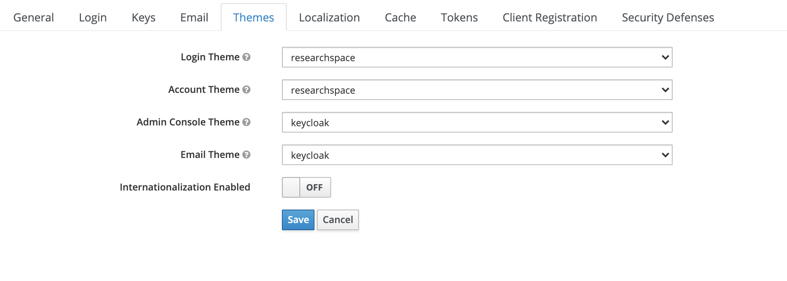

# ResearchSpace Keycloak theme for login page, user registration, and account management page.

This is s a customized Keycloak theme for ResearchSpace that you can integrate with your deployment. It can be used with a Keycloak instance that is hosted together with your ResearchSpace instance or on a remote server that provides authentication. For setting up a remote server in a docker container that provides authentication on AWS, together with a manged RDS database, NGINX proxy with Let's Encrypt, please see the following git repository:

https://github.com/lklic/keycloak-letsencrypt-aws-rds


Please see here for more info on customizing themes:

https://www.keycloak.org/docs/latest/server_development/#_themes

# Themes:

### Login
A user interface for users when they log into the platform, as well as when they register a new account. You can add or remove various fields that you would like users to fill out when creating an account. These fields are mapped as a key:value pair in your Keycloak instance.


### Account

A user interface that allows users to update their password, account info, add 2FA providers, etc.)

The account page is accessible here and you should link to it from your ResearchSpace instance from your "accounts" menu:

```<server-root>/auth/realms/{realm-name}/account/?referrer=auth&referrer_uri=https://my-rs-instance.com```

By adding the referer URL, when a user navigates to the account management page a link is added in the header that will take them back to your ResearchSpace instance.

*Please make sure you are using Keycloak version 12.0.4 at minimum, as there is a [bug](https://issues.redhat.com/browse/KEYCLOAK-16683) in earlier versions that prevents the accounts page from loading with custom fields*

# Docker Configuration
To load the theme up into your Keyclaok docker instance, map the the local theme folder to a docker volume within Keycloak:


```
    volumes:
      - /path/to/my/themes/researchspace:/opt/jboss/keycloak/themes/researchspace
      - /path/to/my/script/disable-theme-cache.cli:/opt/jboss/startup-scripts/disable-theme-cache.cli
```

During theme development you will also want to disable theme caching, you can use the included script to override the caching setting without going into the docker container itself. Once you are done customizing the theme it is good to re-enable caching (by removing this volume mapping) as this will have performance implications.

# Keycloak Configuration
In your Keycloak realm, you can change the theme by navigating to the "Themes" tab. There you should change the "Login" and "Account" themes to "researchspace". The "Admin Console" and "email" themes determine the Admin console and email templates for your instance, and can remain unchanged:

