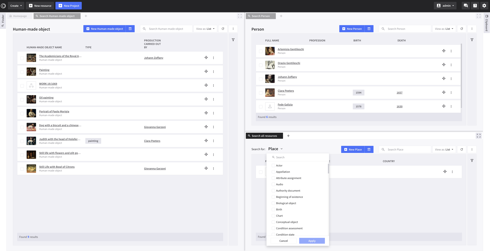
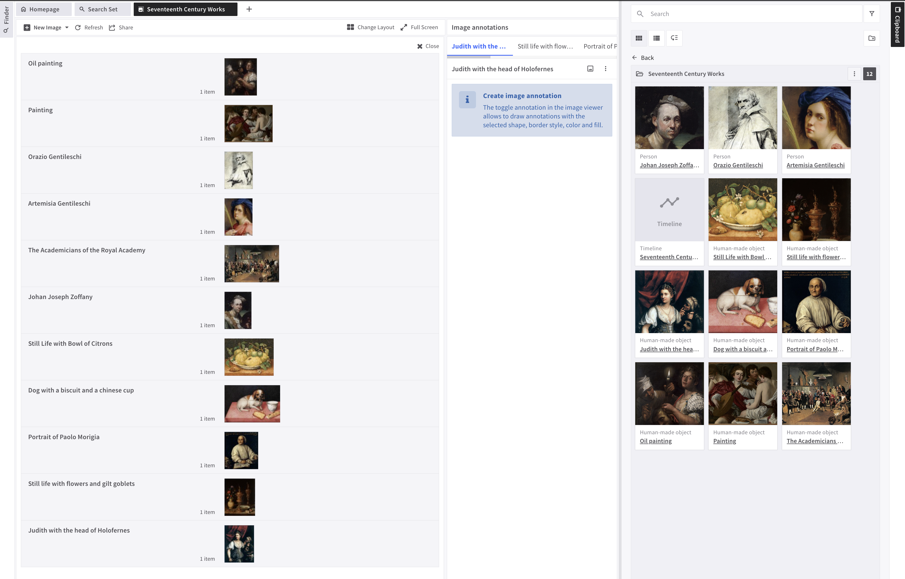
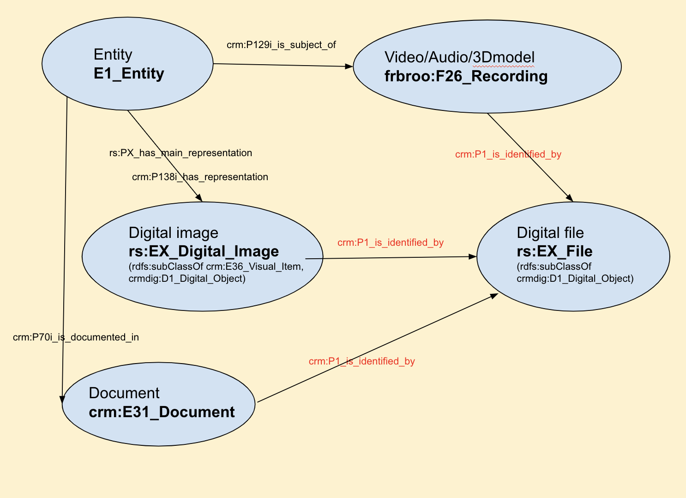
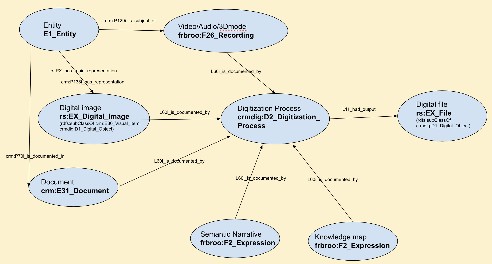
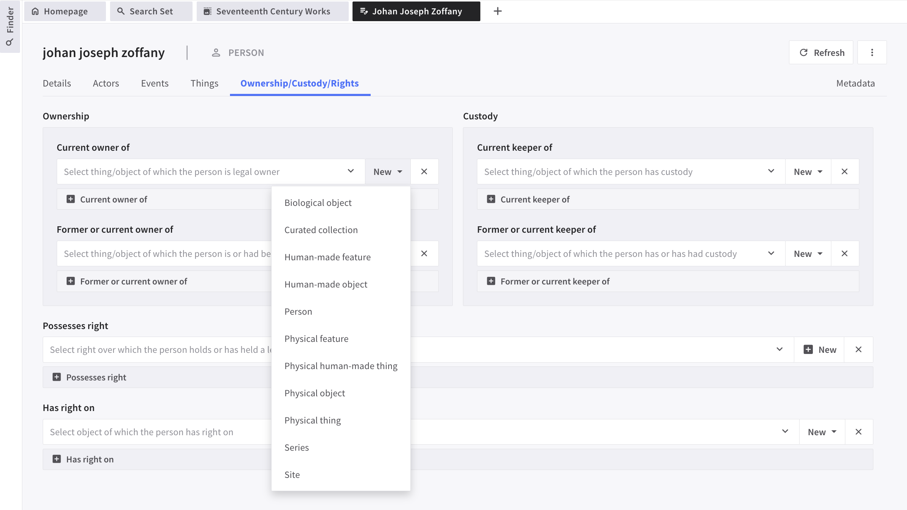

# Release Notes - ResearchSpace 4.0.0
## Release Date - 2024-11-19
The ResearchSpace codebase has been growing and changing for more than a decade, bringing together work from various projects in different development environments. This distributed work needed consolidation and was the main motivation for the work carried out in this release, which incorporates the most relevant pull requests from various branches, issues fixes, and a new default user interface directly supporting and mirroring the CIDOC CRM ontologies. Overall, it provides an accessible non-technical starting point for a ResearchSpace project, with mechanisms to record primary sources, add interpretations, annotate, build visual arguments or synthesise. 


Previously, the platform was available with just a small number of example templates, not designed to work together and difficult to reuse. This meant a lot of time and effort was expended by each new project to repeatedly set up the same types of templates for viewing, editing or searching through data. In contrast to this, in this release we reviewed the process of building on ResearchSpace as a platform and we added a large number of templates and customisations coherently connected that showcase good practices when creating ResearchSpace-based projects. This will enable quick prototyping and experimentation with data that can be engaging for researchers early on.

## Summary of changes
### A full  CIDOC CRM authoring system

The current release offers a unique way of recording data with semantics based on an exhaustive collection of interconnected resource templates, allowing one to start by adding any [new resource based on CIDOC CRM ontology](./images/release4/NewResource.png). For example, one can start by selecting [new Human-Made Object](./images/release4/NewHumanMadeObject.png) and progressively adding more details such as who created it, when was it produced, and any other relevant information. The form's inputs reflect all applicable relationships (properties) from the CIDOC CRM ontology. Thus, through the UI a wide range of data can be captured, creating complex semantic data networks without the need for modelling. [Work by Giovanna Garzoni, data visualisation in the Knowledge Map](./images/release4/DogWithABiscuit.png) 


### The elements of a ResearchSpace instance

Setting up a system using the ResearchSpace platform is a process of generating or importing semantic data modelled using a set of *ontologies* , producing *knowledge patterns* for creating or visualising linked data connections, defining *templates* (application and resource templates) and customising *components* for constructing specific user interfaces based on one's project requirements ([more details in ResearchSpace documentation](https://documentation.researchspace.org/resource/rsp:Start)). So far, the platform has been available without a default UI, which made it difficult for users and developers alike to see its potential for specific projects, and meant significant time was needed in each instance to put together an application. The revisions aim to make it easier to setup the key parts of a project, with better mechanisms of managing ontologies and knowledge patterns, as well as a new way of explicitly configuring how particular entity types (e.g. all E21 Person or all E22 Human-Made Objects in a system) are managed from authoring to visualisations in different parts of the default user interface.

#### Knowledge Patterns

In previous versions, the platform was available with just a small number of example templates and a set of [dependant knowledge patterns](https://github.com/researchspace/researchspace-instance-configurations); This was problematic to maintain; they resided in a separate repo and often missed as a prerequisite when preparing a new ResearchSpace instance; also, no clear UI based way for the categorisation of the knowledge patterns was in place. Hence, the following have been introduced:
  
  * A new way of [categorising the knowledge pattern when created](./images/release4/KPCategories.png), with [categories](./images/release4/KPsCategories.png) visible in the KPs catalogue in the Admin section. 

  * There are  three main groups of knowledge patterns in any instance: 
		* system patterns which cannot be edited and are used by the default UI
		* ontology patterns which are auto-generated from the ontologies and also read only [auto-generated KPs for the uploaded ontologies](./images/release4/KPsAutogenerated.png)
		* custom knowledge patterns created for the current application; they can also be generated based on system or patterns using the ```Duplicate``` functionality
 
### Ontologies
 
Ontology management has been improved. The codebase now contains revised files for the following [ontologies](./images/release4/OntologiesList.png):
* CIDOC 7.3.1 (including CRMpc 1.2)
* CRMArcheo 1.4
* CRMba 1.4
* CRMdig 3.2.1
* CRMgeo 1.2
* Influence
* CRMsci
* FRBRoo
* skos

Note, these are loaded only when ```loadDefaultConfig``` in the global.prop is set to 1 (see section **How to enable/disable the default UI** for more details)

The system now supports: 
  * Automatic generation and tagging of knowledge patterns when an ontology is uploaded
  * Delete of all the associated knowledge patterns when an ontology is removed from the system
  * [Ontology properties search with inference](./images/release4/OntologiesPropertiesSearchTool.png) across the ontologies available in a running system and [ontologies elements search](./images/release4/OntologiesElements.png)
  * Support for upload of ontologies in either owl and rdfs formats 

 
### Authority Documents (vocabularies) integration
The default UI relies on a set of vocabularies, which can be **edited**:   
  * [System authority documents](./images/release4/SystemAuthorityDocumentList.png) 
  * Other authority documents required by KPs or default templates 


### Resource Configurations
#### What is a Resource in ResearchSpace?
A resource is a ResearchSpace encoding of a  **real world entity** and is used to support the authoring of all instances of that entity. For example **Giovanna Garzoni** modelled as an **instance of an ontology class** such as **E21 Person** and further specialised as an **artist** by using the P2 has type relationship.

#### Managing resources
**Resources** is a new area in the Admin interface where resource configurations are defined. A configuration groups together information about how an instance of that resource is identified, how it is discovered, how the resource is represented in the interface, and its template for data input. Overall, these additions make it easier to customize the default UI depending on a project's data.   
 

#### Defining Resources
For example, in a [New Person configuration](./images/release4/ResourceConfigurationPerson.png) it is required to specify the ontology class (E21 Person), and additionaly state the [semantic form used for editing an instance of a Person](./images/release4/ResourceConfigurationPersonEditVisualisation.png), or [describe the structure of authority documents based on that resource type](./images/release4/ResourceConfigurationPersonIsListedIn.png), as well as describe its visual representations through icons or labels in the system.

The codebase includes a selection of 90+ configurations that can be customised further:

  * *System Resources Configurations:*
Knowledge Pattern Category, Chart, Timeline, Image Annotation, Knowledge Map, Semantic Narrative, Set, Set Item, User
  * *CIDOC CRM Classes Resource Configurations*
Acquisition, Activity, Actor, Appellation, Attribute assignment, Audio, Authority document, Beginning of existence, Biological object, Birth, Conceptual object, Condition assessment, Condition state, Creation, Curated collection, Curation activity, Currency, Death, Design or procedure, Destruction, Dimension, Dissolution, Document, End of existence, Entity, Event, Exhibition, Formation, Group, Human-made feature, Human-made object, Human-made thing, Identifier, Identifier assignment, Image, Information object, Inscription, Joining, Language, Leaving, Legal object, Linguistic object, Mark, Material, Measurement, Measurement unit, Model 3D, Modification, Monetary amount, Move, Organisation, Part addition, Part removal, Period, Persistent item, Person, Physical feature, Physical Human-made thing, Physical object, Physical thing, Place, Product type, Production, Project, Propositional object, Publication, Purchase, Research question, Right, Series, Site, Symbolic object, Term, Thing, Timespan, Title, Transfer of custody, Transformation, Type, Type assignment, Type creation, Video, Visual item


**IMPORTANT** Do not create a new configuration for an ontology class from the list above, but just modify the existing configuration. Otherwise, a custom configuration can be created adding a configuration *Type*.

**IMPORTANT** The resource configurations are intended to make it explicit what templates are being used for a new instance of that resource. 

The existing [resource templating mechanism](https://documentation.researchspace.org/resource/rsp:Documentation_Templates#rs-doc_resourceTemplate) can still be used for visualising resources, by customising the ```templateIncludeQuery``` in the Admin/UI, Environment, Global & Data Quality section. The default UI templates do not rely on this UI setting.

  
### How to enable/disable the default UI
There are four new repositories: ```configurations```, ```system```, ```ontologies```, and ```authorities```. These contain information that supports the default UI. For a new installation of the system these will be loaded and reloaded on start when the setting ```loadDefaultConfig``` is  1 in the runtime-data/config/global.prop or in the your-custom-app/config/global.prop. In developer mode, just add "-Dconfig.global.loadDefaultConfig=1" to build.gradle script.
* The ```configurations``` repo is a group of named graphs each containing a resource configuration
* The ```system``` repo is a set of knowledge patterns that cannot be edited by the users of the system and are a prerequisite for the functioning of the default templates.
* The ```authorities``` repo is a set of crm:E32 Authority Documents created using RS that are referred to by the system knowledge patterns and default templates.
* The ```ontologies``` repo is a set of ontologies: CIDOC 7.3.1 (including CRMpc 1.2), CRMArcheo 1.4, CRMba 1.4, CRMdig 3.2.1, CRMgeo 1.2, Influence, CRMsci, FRBRoo, skos (not an ontology).

  The current implementation covers the following scenarios:
  1. For a new RS system setup with an empty graph-database all repositories above are loaded for the first time, if the ```loadDefaultConfig``` was not set; if you want your system to load future updates the flag needs to be set explicitly to 1.
 
  2. For an existing system with content in its graph-database, the loading process will check if the ```loadDefaultConfig``` is set to 1. If true, ```configurations``` and ```authorities``` are loaded, and can be edited by the user. The ```system``` repo is also loaded. And finally the ```ontologies``` are loaded only if no other ontologies already exist. A user can work with their own choice of ontologies, but note that the templates provided have been customised based on CIDOC CRM 7.3.1.


**IMPORTANT** Setting the flag to 0 will not load any of the repositories above and the Resources and Ontologies sections in the Admin section will be **broken**. For existing systems, the default UI should not create any conflicts with the existing setups, but do investigate your logs which will reflect if such conflicts occur.

### Importing Data
#### Using REST APIs (Wikidata, OSM, MET, V&A, and TNA) 
 We designed and integrated a simple import workflow part of the process of creating a **New Resource** for relevant entities like *Biological object, Curated collection, Human-made feature, Human-made object, Physical feature, Physical human-made thing, Physical object, Series, Site, Place, Organisation, Actor, Group,* and *Person*. By importing from external resources a quick scaffolding of semantic data with provenance is built.

For example, when adding a [New Person](./images/release4/NewPersonImportPerson.png), click import from External Resource and [Search on wikidata for Artemisia Gentileschi](./images/release4/ImportArtemisiaFromWikidata.png), 
[add an image](./images/release4/ImportingImagesFetch.png) and the [imported data from Wikidata](./images/release4/ImportPersonFromWikidata.png) is now part of the system. This functionality is only saving a small set of properties available via the APIs, more can be added by extending the existing templates.

Similarly, other external sources can be selected: [Search and Import from the V&A](./images/release4/SearchAndImportFromVAM.png), [Search and Import from TNA](./images/release4/SearchAndImportFromTNA.png)  
 
#### SQL Integration [#320](https://github.com/researchspace/researchspace/pull/320) ([see more details](https://docs.google.com/document/d/1lz6vcVqVXbYsJLewqhooCYN23HBlvl090PwKtqIPqDQ/edit?tab=t.0#heading=h.fcjg17gz0pr7))

### User Interface / User Experience / Visualisations
| Feature         | Description         |
|--------------------|-------------------|
| Frames | The frame system allows a layout where multiple windows are opened, displayed and placed in tabs, allowing an arrangement of different views, exchanges of information between them, and in many cases a refresh of information when frames hold the same or connected information. The component is based on the [FlexLayout layout manager](https://github.com/caplin/FlexLayout)|
| Finder       | This is a configurable tab, an entrypoint for browsing resources. It is configured under [Resource configuration of a particular resource](./images/release4/ResourceConfigurationPersonFinder.png). As part of the properties one can specify whether the resource is listed in finder and choose an icon for it. Finder organises entities in user defined hierarchies grouped under three headings: Favorites, Libraries, and System|
|Resource Searches|All [configured resources](./images/release4/ResourceConfigurationPersonSearch.png) have a section for describing their search page that can be accessed through Finder. It is possible to select dynamically which views will be available for search pages: List, Grid, Chart, or Timeline; for the *list view*, one can specify the sparql query used for each column, presenting either a description, or other data in the results listing; additionally, the search page will also provide facets based on the knowledge patterns category selected in this section.  Apart from individual resource search pages, a ```Search All Resources``` is also available:|
|Contextual Drop-Down Menu| Through the current UI three vertical dots indicate the presence of a contextual menu with triggers for actions available depending on the nature of the resource or the application templates. Here are some examples of context menus for: [Places](./images/release4/PlaceContextMenu.png), [Timelines](./images/release4/TimelineContextMenu.png), [Search Results](./images/release4/SearchContextMenu.png), [Objects](./images/release4/ObjectContextMenu.png), etc. Across resources a few functionalities are always present: ```Copy IRI```, ```Copy to clipboard```, ```Open in Knowledge Map```, ```Edit```, and ```Preview```. **IMPORTANT** In the contextual menu the ```Share edit``` or  ```Share Image Annotation```, etc. will generate a URL that can be used as a way of directly viewing a resource in a particular view (i.e. in a form or an image annotation frame)|
|Clipboard | It is an individual space where a user places relevant resources. ```Copy to clipboard``` is now an action available from the *contextual menu* of all resources.   |
|Sets|Sets in previous versions were created in the clipboard or saved to the clipboard from the results list of a search. Sets were only visible in the Clipboard. Now, a set has its own search page and it can be added or removed from clipboard as needed. Sets are D1 Digital Object and have an extended form allowing a user to specify information about the set using CIDOC CRM relations [Artemisia's Self-Portraits](./images/release4/SetMultiViews.png)|
|Charts| A chart is created through any of the search pages, by selecting Chart view and a visualisation context. It can then be saved and it becomes a system resource that changes depending on the data in the system: [Object categorisation by type chart in Multiple Views](./images/release4/ChartEditAndSearch.png). Charts are modelled as D1 Digital Objects, enabling us to add further context to them.|
|Knowledge Maps| Updated elements in the Toolbar of the KMs adding refresh and contextual menu buttons; Separated ```Save data``` and ```Save map``` functionality, and enabled an extended context form: [Knowledge Map of Giovanna Garzoni's Works](./images/release4/KMMultiViews.png)|
|Maps|Added visualisations within relevant resources when coordinate data is available: [Frankfurt edit view](./images/release4/PlaceEdit.png)|
|Semantic Narratives| Updated elements in the Toolbar of the SN adding refresh and contextual menu buttons; Enabled visualising on a separate page all related resources for a narrative: [Artemisia's London Residence](./images/release4/SNMultiViews.png)|
|Timelines|A timeline is created through any of the search pages, by selecting Timeline view. In this example, the timeline reflects the existing data for persons [Seventeenth Century Contemporaries](./images/release4/Timeline.png). Similarly to charts, timelines are modelled as Digital Objects and further context can be added through a form: [Timeline Multiple Views](./images/release4/TimelineEditAndSearch.png)|
|Image Annotation|Image Annotation as a functionality was possible only for Images. This was extended for any entity that has an image or images as representations. In this example a set of human made objects: |
|Events and Notifications| Using the existing event system, communication and exchange of information across frames has been improved with automatic refreshes of search pages when a new resource is created, modified or deleted. Notifications of the results of ones actions via the UI have clear feedback ('Resource created', 'Success', 'Warning', etc.)|
|System Activities| A section in the UI that reflects when resources are created or modified, providing a sense of the history and provenance of the data [System Activities](./images/release4/SystemActivities.png). This is a first iteration in recording in the data when resources are created or edited. It isn't setup currently to record with fine granularity when each aspect of resource is being changed.   |


#### Other improvements:
* resource card redesign to include the contextual menu instead of previous hover effect
* responsive templates implementation inside frames using [container queries](https://developer.mozilla.org/en-US/docs/Web/CSS/CSS_containment/Container_queries)
* addition and consistent use of [Google Material symbols](https://fonts.google.com/icons?icon.set=Material+Symbols) for all icons in the UI


### Semantic Modelling

| Resource  Type      | Modification         |
|--------------------|-------------------|
|Semantic Narrative, Knowledge Map | Added rdf:type frbroo:F2_Expression|
|Chart, Set, Set Item, Timeline | Added rdf:type crmdig:D1_Digital_Object|
|Audio/Video/3D | Changed from frbroo:F21_Recording_Work to frbroo:F26_Recording|
|Relationship between an E1_Entity and the EX_File pointing to the file storing an Image, Doc, Video, Audio, 3D| Previous mapping:  Current Mapping: |
|Forms| Introduced a mechanism to store creation and modifications of forms. Changes are visible by opening the ```Metadata``` tab in the resource forms or in the **System Activities** page|


### Semantic Components
#### Dashboard

* reinstating linked views functionality (image graph annotation functionality has been fixed)
* frames tab labelling 
* customLabel prop
* renaming of tabs when new resources are created (new Knowledge Map, new Resource of any type) 
* support for FlexLayout event [addTabWithDragAndDrop](https://rawgit.com/caplin/FlexLayout/demos/demos/v0.8/typedoc/classes/Layout.html#addTabWithDragAndDrop)

#### Select and Auto-Complete Input

Replaced the ```nested-form-template``` with ```nested-form-templates```. This provides a user further options for choosing an appropriate type for the *New* resource to be created.




```html
<semantic-form-autocomplete-input   
	for="actor_current_owner_of"
	label="Current owner of" 
	placeholder="Select thing/object of which the user is legal owner" 
	nested-form-templates='[
		{
		"label": "Biological object",
		"nestedForm": "{{{{raw}}}}{{> \"http://www.researchspace.org/resource/system/forms/BiologicalObject\" nested=true editable=true mode=\"new\" }}{{{{/raw}}}}"
		},
		{
			"label": "Curated collection",
			"nestedForm": "{{{{raw}}}}{{> \"http://www.researchspace.org/resource/system/forms/Collection\" nested=true editable=true mode=\"new\" }}{{{{/raw}}}}"
		},
		{
			"label": "Human-made feature",
			"nestedForm": "{{{{raw}}}}{{> \"http://www.researchspace.org/resource/system/forms/HumanMadeFeature\" nested=true editable=true mode=\"new\" }}{{{{/raw}}}}"
		},...']> 
</semantic-form-autocomplete-input> 
```


### Other Updates ###

**Node 20, Webpack 5**

Updated all major dev dependencies to node 20 like webpack, typescript and sass:
[more details here](https://github.com/researchspace/researchspace/pull/325)


### Deprecated features

- **researchspace-instance-configurations**

  [github repo](https://github.com/researchspace/researchspace-instance-configurations) dependant knowledge patterns no longer required


