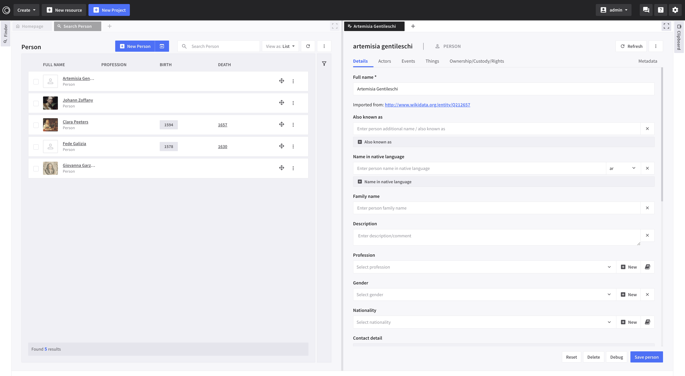
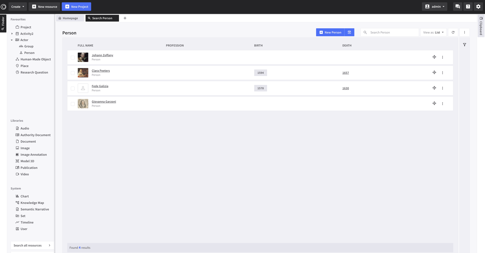

# Release Notes - ResearchSpace 4.0.0
## Release Date - 2024-11-19

> The ResearchSpace codebase has been growing and chaging for more than a decade. A variety of projects have been using this platform developing and improving it, albeit in separate setups. This created a need for the consolidation work carried out in this release, by incorporating some of the most relevant PRs, and introducing a new default user interface that supports modelling using CIDOC CRM ontologies, as well as an easy way to start a research project, with mechanisms to record primary sources, add interpretions, annotate, build visual arguments or synthesize narratives. 

> Across existing projects in particular in Cultural Heritage, several key problems have been preventing new knowledge and new thinking to be added to existing structures. In these cases the legacy data has no clear history, semantics, or any mechanisms to add new interpretations, corrections, and current research. One of the main impediments has been the use of non-semantic technologies and use of relational databases. A platform such as ResearchSpace overcomes the technological restrictions, but still poses the challenge of enabling non-technical users, experts in particular areas to be creators and publishers of their own semantic data. This was the key motivation for introducing with this release a set of default system resource configurations, authority documents, knowledge patterns and templates that build together a complex coherent UI, enabling a user to work with semantic data both directly or via interactive visualisations. 

> Previously, the platform was available with just a small number of example templates, which involved loading from another [github repo](https://github.com/researchspace/researchspace-instance-configurations) dependant knowledge patterns -- obsolete from this version onwards. The previous templates were not designed to work together, they were just disparate starting points for developers. This meant a lot of time and effort was spent by each new project to repeatedly set up the same types of templates for viewing, editing or searching through data. It also, led to implementations that did not take full advantage of the RS functionalities. 

> Overall, this release brings with it a review of how to build on ResearchSpace as a platform and offers a more accessible starting point for developers with default templates, complex customisations that encourage good practices when creating ResearchSpace-based projects. It enables quick prototyping and experimentation with data that can be engaging for researchers early on. 


## Summary of changes
### A visual way of representing reality with CIDOC CRM ontologies 

The current release offers a unique way of recording data with semantics based on an exhaustive collection of resource templates, interconnected, allowing one to start by adding any [new resource based on CIDOC CRM ontology](./images/release4/NewResource.png). For example, selecting [new Human-Made Object](./images/release4/NewHumanMadeObject.png) and progressively adding more details such as created it, when was it produced, and any other information including using ranges for dates which are notoriously difficult to know with certainty. Thus, through the UI a whole new context is captured in semantic data. [Work by Giovanna Garzoni, early research with visualisation in the Knowledge Map](./images/release4/DogWithABiscuit.png) This dual process of authoring and visualising supports qualitative data creation.


### Re-organising how resources are managed in ResearchSpace
  > The elements for creating a system using the ResearchSpace platform are semantic data created by modelling reality using *ontologies*, *knowledge patterns* (a mechanism to define the insert, select, delete SPARQL patters, etc for creating linked data connections), *templates* (application and resource templates) and its many *components* that enable constructing interactive user interfaces ([more details in ResearchSpace documentation](https://documentation.researchspace.org/resource/rsp:Start)).

  #### Knowledge Patterns
  Historically, the platform was available with just a small number of example templates and a set of [dependant knowledge patterns](https://github.com/researchspace/researchspace-instance-configurations); This was problematic to maintain, it resided in a separate repo and often missed as a prerequisite when preparing a new ResearchSpace instance; also, no clear categorisation of the knowledge patterns was in place. We introduced the following:
  
  * A new way of [categorising the knowledge pattern when created](./images/release4/KPCategories.png) and made these [categories](./images/release4/KPsCategories.png) visible in the KPs catalogue in the Admin section. One can now easily group them and get a clear view of the setup of the KPs in the system.

  * There are three main groups of knowledge patterns in any instance: 
    - custom KPs created for the current application
    - system KPs introduced with this release (not editable)
    - [auto-generated KPs for the uploaded ontologies](./images/release4/KPsAutogenerated.png)(not editable)
    
  #### Ontologies
  As the mapping of data relies on ontologies, we have fixed the Ontologies section of the Admin section and improved the way ontologies are managed within a system.
  
  * The codebase now contains revised files for the following [ontologies](./images/release4/OntologiesList.png): CIDOC 7.3.1 (including CRMpc 1.2), CRMArcheo 1.4, CRMba 1.4, CRMdig 3.2.1, CRMgeo 1.2, CRMinfluence, CRMsci, frbroo, skos; Note, these are loaded only when ```loadDefaultConfig``` is set to 1 (see section *** below for more details)
  * Support for automatic generation and tagging of knowledge patterns when an ontology is uploaded
  * Delete of all the associated knowledge patterns when an ontology is removed from the system
  * [Ontology properties search with inference](./images/release4/OntologiesPropertiesSearchTool.png) across the ontologies available in a running system and [ontologies elements search](./images/release4/OntologiesElements.png)
  * Support for upload of both owl and rdfs descriptions of ontologies

  #### Authority Documents (vocabularies) integration 
  There are a set of editable vocabularies provided as needed by templates or other functionalities:   
  * [System authority documents](./images/release4/SystemAuthorityDocumentList.png) (editable)
  * Other authority documents required by KPs or default templates (editable)
  
  #### Resource Configurations
  #### What is a resource in ResearchSpace? 
  It is a technical term that refers to a **real world entity** such as **Giovanna Garzoni** modelled as an **instance of an ontology class** such as **E21 Person** , and further specialised as an **artist** by using the P2 has type relationship, connecting to an entry from a thesaurus. 

  #### Working with resources 
  In the admin configurations section, we introduced a new section namely **Resources**  where one can specify explicitly how to manage a resource (e.g. [Person configuration](./images/release4/ResourceConfigurationPerson.png)) in terms of editing it via [semantic forms](./images/release4/ResourceConfigurationPersonEditVisualisation.png), visualisations, [use in authority documents](./images/release4/ResourceConfigurationPersonIsListedIn.png), and consistent visual representations through icons or labels. Previously, this information was not available through the UI, and as projects grew maintenance of the codebase became more difficult. 

  There is a selection of 90+ configurations predefined that can be customised further:

  * *System Resources Configurations:*
    KP Category, Chart, Timeline, Image Annotation, Knowledge Map, Semantic Narrative, Set, Set Item, User

  * *CIDOC CRM Classes Resource Configurations*
  Type, Group, Organisation, Material, Model 3D, Acquisition, Activity, Actor, Appellation, Attribute assignment, Audio, Authority document, Beginning of existence, Biological object, Birth, Conceptual object, Condition assessment, Condition state, Creation, Curated collection, Curation activity, Death, Design or procedure, Destruction, Dimension, Dissolution, Document, End of existence, Entity, Event, Exhibition, Formation, Identifier, Identifier assignment, Image, Information object, Inscription, Joining, Language, Leaving, Linguistic object, Human-made feature, Human-made object, Mark, Measurement, Modification, Move, Part addition, Part removal, Period, Persistent item, Person, Physical feature, Physical Human-made thing, Physical object, Physical thing, Place, Production, Project, Propositional object, Publication, Research question, Right, Series, Site, Symbolic object, Term, Timespan, Title, Transfer of custody, Transformation, Type assignment, Type creation, Video, Visual item


**IMPORTANT:** Resource configurations are intended to make it explicit what templates are being used for a resource. The resource templating mechanism remains in place [resource template](https://documentation.researchspace.org/resource/rsp:Documentation_Templates#rs-doc_resourceTemplate), but it wasn't sufficient for creating a complex UI*

**IMPORTANT:** Do not create a new configuration for an ontology class from the list above, but just modify the existing configuration. Otherwise, a custom configuration can be created adding a configuration Type*

#### How to enable/disable the default UI
  There are now four new repositories: "configurations", "system", "ontologies", "vocabularies" which can be loaded by setting ```loadDefaultConfig``` to 1 in the runtime-data/config/global.prop or in the your-custom-app/config/global.prop and in developer mode just add "-Dconfig.global.loadDefaultConfig=1" to build.gradle script.

  The ```configurations``` repo is a group of named graphs each containing a resource configuration.
  The ```system``` repo is a set of knowledge patterns that cannot be edited by the users of the system and are a prerequisite for the functioning of the default templates.
  The ```vocabularies``` repo is a set of crm:E32_AuthorityDocuments created using RS that are referred to by the system knowledge patterns and system default templates.
  The ```ontologies``` repo is a set of ontologies: CIDOC 7.3.1 (including CRMpc 1.2), CRMArcheo 1.4, CRMba 1.4, CRMdig 3.2.1, CRMgeo 1.2, CRMinfluence, CRMsci, frbroo, skos (not an ontology).

  The current implementation covers the following scenarios:
  1. For a new RS system setup with an empty graph-database all repositories are loaded for the first time regardless if the loadDefaultConfig was set as 0 or 1, but if you want your system to load updates you still need to set this flag.
  2. For a RS system with content in its graph-database, the LDPAssetsLoader will check if the loadDefaultConfig is set. If true, configurations and vocabularies are loaded, and can be overwritten by the user as the system is being used. The system repository contains solely knowledge patterns that cannot be edited. And finally the ontologies are loaded only if no other ontologies already exist. A user can work with their own choice of ontologies, but note the templates provided have been customised around CIDOC CRM 7.3.1.

**IMPORTANT** We encourage setting the flag to 1 even for existing systems, as some of the templates in the Admin section will be broken otherwise. 
  

#### Importing Resources using REST APIs (Wikidata, OSM, MET, V&A, and TNA) 
  Working with data is a big topic, and the most frequent issues are:
1. how do to bring in data that already exists (in some format, not necessarily mapped to linked data) into the system
2. represent its provenance 
3. expand common knowledge in the context with ones project without duplication

Often, the solution to these is acomplished in pre-processing of the data part of a workflow of adding data. Though that is a good solution in some contexts, for a non-technical user that is too complicated as a first step, therefore we designed and integrated in the process of creating a **New Resource** for relevant entities like Person, Place, Human-Made Object, etc. a way to import from external resources with the option of adding and mapping to semantic data with one click.

A simple workflow: [New Person](./images/release4/NewPersonImportPerson.png), click import from External Resource and [Search on wikidata for Artemisia Gentileschi](./images/release4/ImportArtemisiaFromWikidata.png), 
[add an image](./images/release4/ImportingImagesFetch.png) and the [imported data from Wikidata](./images/release4/ImportPersonFromWikidata.png) is part of the system. This functionality is only bringing some of the elements available via the APIs. More can be added by extending the existing templates.

Screenshots: [Search and Import from the V&A](./images/release4/SearchAndImportFromVAM.png), [Search and Import from TNA](./images/release4/SearchAndImportFromTNA.png)  
 
   
 **Finder**

  {Feature description}

 [Resource Configuration Person -- Finder Section](./images/release4/ResourceConfigurationPersonFinder.png)

 **Default Resources Search**

  

  * Individual Resource Search Pages
  * All Resources Search Page


[Resource Configuration Person -- Search Configuration](./images/release4/ResourceConfigurationPersonSearch.png)


#### Image Annotation for All
 
Redesign 

#### Frames Layout


#### Events and Notifications


#### UI 
contextual dropdown menu
card redesign
review of templates to be responsive inside frames view: https://developer.mozilla.org/en-US/docs/Web/CSS/CSS_containment/Container_queries
Google Material symbols

https://fonts.google.com/icons?icon.set=Material+Symbols

Modified form select, autocomplete tree input 

User form 


### Changes to Semantic Modelling

Change mapping for SN and KM to F2_Expression
Modified mapping for Audio/Video/3D from F21 to F26_Recording
Modified crm:P1_is_identified_by/rs:PX_has_file_name for images/docs with new mapping crmdig:L60i_is_documented_by/crmdig:L11_had_output/rs:PX_has_file_name
- Modified mapping for EX_File in Image, Doc, Video, Audio, 3D

  [Media previous mapping](./images/release4/media_previous_mapping.png)

  [Media new mapping](./images/release4/media_new_mapping.png)


### Changes to Semantic Components

  {Improvement description}

<table>
  <tr>
    <th>Semantic Component</th>
    <th>Improvement</th>
  </tr>
  <tr>
    <td>Dashboard</td>
    <td><strong>Frames Tab Labelling </strong><br><br>
    * customLabel prop
    * add trigger events to rename tabs when new resources are created (new Knowledge Map, new Resource of any type)
    </td>
  </tr>
   <tr>
    <td>Sets</td>
    <td><strong></strong><br><br>
      Add support for sets to be added and removed from clipboard, but not deleted from the system
    </td>
  </tr>
<tr>
    <td>Charts</td>
    <td><strong></strong><br><br>
      Add support for sets to be added and removed from clipboard, but not deleted from the system
    </td>
  </tr>
<tr>
 <td>Timelines</td>
    <td><strong></strong><br><br>
      Add support for sets to be added and removed from clipboard, but not deleted from the system
    </td>
  </tr>
  <tr>
    <td>Select Input</td>
    <td><strong> </strong><br><br>
Added urlqueryparam-open-as-drag-and-drop="true" to autocomplete, select-input, treePickerInput resource link

remove nested-form-template and replace with nested-form-templates
    </td>
  </tr>
  <tr>
    <td>Autocomplete Input</td>
    <td><strong>guide-content-type.md</strong><br><br>This guide provides a deeper explanation of how to fill in the template. It provides a lightweight introduction to the purpose of this documentation and explains how to fill in each section of the document.</td>
  </tr>
  <tr>
    <td>RDFUploader</td>
    <td><strong>resources-content-type.md</strong><br><br>This document includes the resources (books, blog entries, guides) that the template author(s) used during the research phase of creating the template. It also includes any high-quality examples of that content type that served as inspiration for the template.</td>
  </tr>
  <tr>
    <td>SemanticTreeInput</td>
    <td><strong></strong><br><br>
    </td>
  </tr>
  <tr>
    <td>SelectionActionChoiceComponent UI</td>
    <td><strong></strong><br><br>
    </td>
  </tr>
<tr>
    <td>semantic-lazy-tree</td>
    <td><strong></strong><br><br>
      Fixed ORDER BY in QueryDefaults.ts
    </td>
  </tr>

</table>


### Bug fixes

- **{Bug fix title}**

  {Bug fix description}

### Updates ###

- **{Node 20, Webpack 5}**

In the docker compose you should have something like:
        - ./.ssh:/home/jetty/.ssh

change it to:
        - ./.ssh:/var/lib/jetty/.ssh

added "material-symbols": "^0.16.0"
### Known issues

- **{Known issue title}**

  {Known issue description}

### Optional: Deprecated features

- **{Deprecated feature title}**

  {Deprecated feature description}

---

> Explore other templates from [The Good Docs Project](https://thegooddocsproject.dev/). Use our [feedback form](https://thegooddocsproject.dev/feedback/?template=Release%20notes) to give feedback on this template.
